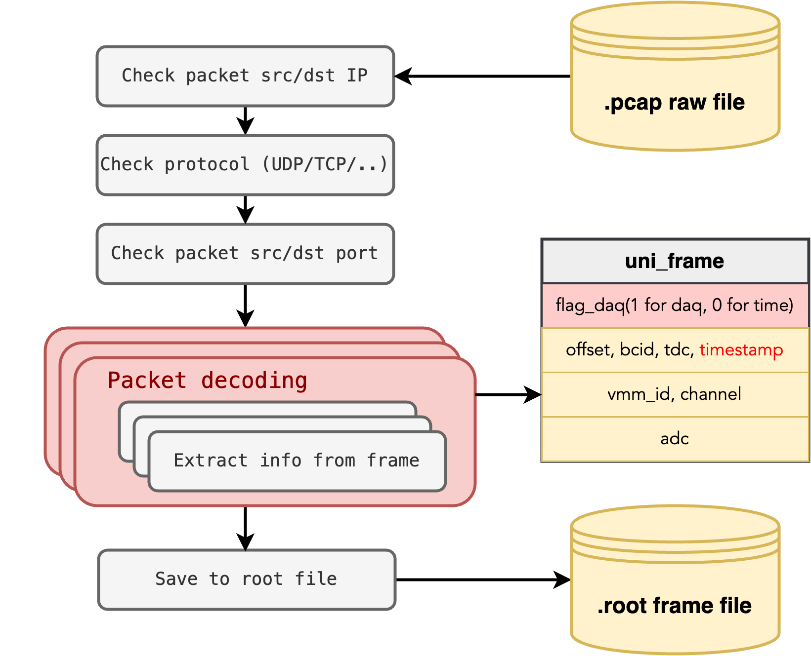

# SRS-VMM Data Reader

    


- [SRS-VMM Data Reader](#srs-vmm-data-reader)
  - [Requirements](#requirements)
  - [Pcap Reader -- `SJSV_pcapreader.cpp/h`](#pcap-reader----sjsv_pcapreadercpph)
  - [Event Builder -- `SJSV_eventbuilder.cpp/h`](#event-builder----sjsv_eventbuildercpph)
    - [a. Data parsing](#a-data-parsing)
    - [b. Mapping](#b-mapping)
    - [c. Quick plotting](#c-quick-plotting)
  - [Data Inspector -- `SJSV_datainspection.cxx`](#data-inspector----sjsv_datainspectioncxx)


## Requirements

- CMake 3.12 or higher
- C++17 compiler
- [CERN ROOT](https://root.cern.ch/) 6.22 or higher
- [PcapPlusPlus](https://pcapplusplus.github.io)


## Pcap Reader -- `SJSV_pcapreader.cpp/h`

This class is used to read the pcap file and extract the data from it. The typical usage is as follows:



## Event Builder -- `SJSV_eventbuilder.cpp/h`

!!! warning
    This class is not yet finished.

This class is used to build the events from the raw data stored by the Pcap Reader. 

### a. Data parsing

Because the raw data contains timing information from different sources, the first step is to parse the data and form unified data structures.


### b. Mapping

To use the mapping functions, the mapping file must be provided. The mapping file is a csv file with the following structure:


Here the `Board Num` stands for the index of readout board/module. The `Channel Num` is the index of channels in one board/module. `Module Num` is the FoCal-H module number, ranging from 0 to 8. `Col` and `Row` are the column and row index in a FoCal-H module.

Here is how the `Module Num`, `Col` and `Row` are defined:


### c. Quick plotting

To help with the testing, serval plotting functions are implemented.

 

- Single channel ADC plot - `quick_plot_single_channel`
- Multiple channel ADC plot - `quick_plot_multiple_channels`
  ```cpp
    auto qb_canvas_multi_ADC = new TCanvas("qb_canvas", "Quick browse", 1200, 1000);
    auto qb_tgraph = eventbuilder.quick_plot_multiple_channels(qp_channel_vec_adc, AOI_Start, AOI_End);
    qb_tgraph->Draw("APL");
    auto _legend = new TLegend(0.7, 0.7, 0.9, 0.9);
    for (auto i = 0; i < qp_channel_vec_adc.size(); i++)
        _legend->AddEntry(qb_tgraph->GetListOfGraphs()->At(i), ("Channel " + std::to_string(qp_channel_vec_adc[i])).c_str(), "l");
    _legend->Draw();
    qb_canvas_multi_ADC->SetGrid();
    qb_canvas_multi_ADC->SaveAs("../pics/quick_browse_multichn.png");
    qb_canvas_multi_ADC->Close();
  ```
- Single channel ADC distribution - `quick_plot_single_channel_hist`
- Time - frame index correlation - `quick_plot_time_index`
  ```cpp
    auto qb_canvas_time_index = new TCanvas("qb_canvas_time_index", "Quick browse time", 1200, 1000);
    auto qb_tgraph2 = eventbuilder.quick_plot_time_index(AOI_Start, AOI_End);
    qb_tgraph2->Draw("APL");
 
    qb_canvas_time_index->SetGrid();
    qb_canvas_time_index->SaveAs("../pics/quick_browse_time.png");
    qb_canvas_time_index->Close();
  ```

## Data Inspector -- `SJSV_datainspection.cxx`

This is acutally a raw data reader. It reads the raw data from the pcap file and plot the most basic information. The output analysis file is named as `analysis_rcslr_Run<run number>v.root`, and the parsed hits are stored in `parsed_Run<run number>v.root`.

!!! note 
    `parsed_Run<run number>v.root` is necessary for most of the rest analysis.


In the `analysis_rcslr_Run<run number>v.root` file, you could find:

- `all_hist`: The ADC distribution of all channels
- `vmm_hist`: The ADC distribution divided by the VMM number
- `time_index`: The time - frame index correlation of the chosen time window
- `channel_hist`: The ADC distribution of individual channels
- `event_chnnum_hist`: The number of channels in each event
- `event_adc_hist`: The **high gain** ADC sum distribution
- `event_adc_hist_low`: The **low gain** ADC sum distribution
- `mapped_event_sum`: The summed hitting map of chosen events
- `mapped_events`: Folder containing the hitting map of chosen events
- `HG`: Distribution of all high gain ADC values
- `LG`: Distribution of all low gain ADC values